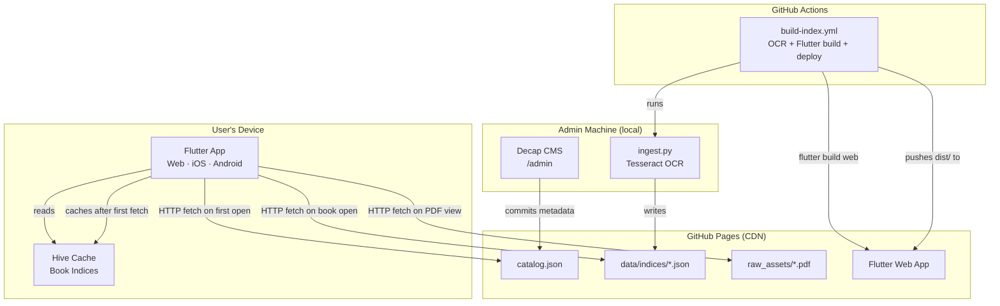

# Architecture

## Overview

The Library Manager is a **serverless, zero-cost** system that lets users search and read traditional Indian language songbooks across web, iOS, and Android from a single codebase. There is no backend server at runtime. All data is static JSON served from GitHub Pages.



## Why Flutter instead of plain HTML/JS

The original spec used vanilla HTML/JS hosted on GitHub Pages. Three hard blockers were identified during feasibility review:

1. **Base URL complexity** — GitHub Pages project repos live at `/repo-name/`. HTML relative paths break silently without careful `<base href>` management. Flutter's `--base-href` flag injects this at build time and all Dart HTTP requests resolve against it automatically.

2. **Service worker versioning** — Plain `sw.js` requires manual cache name versioning to prevent users from running stale code. Flutter Web generates a versioned `flutter_service_worker.js` automatically on every build.

3. **Mobile UX** — Native PDF rendering (`pdfx` uses PDFKit on iOS, Android PDF API on Android) and proper gesture handling are significantly better than a PDF.js canvas renderer for users reading long texts on phone or tablet.

Switching to Flutter also provides a free **iOS/Android native build path** from the same codebase — no rewrite needed when App Store distribution is required later.

## Why no backend server

A Python backend was considered and rejected. The search is client-side (JSON loaded into memory), files are static, and OCR runs in GitHub Actions. A backend would add:
- Hosting cost (free tier has cold starts of 15–30s on first request)
- Another system to maintain
- No functional benefit for the described use case

## Directory structure

```
.github/workflows/
  build-index.yml       CI/CD: OCR + Flutter build + GitHub Pages deploy

lib/                    Flutter/Dart source
  main.dart             Entry point: Hive init → runApp
  app.dart              LibraryApp widget, go_router config, AppServices InheritedWidget
  config.dart           AppConfig.resolveUrl() — URL builder for web and mobile
  models/
    book.dart           Catalog entry model (deserialized from catalog.json)
    song.dart           Song index entry model (deserialized from book index JSON)
  screens/
    library_screen.dart Book catalog list with pull-to-refresh
    book_screen.dart    Per-book search with live filtering
    pdf_screen.dart     PDF viewer (pdfx, opens at song's page number)
  services/
    catalog_service.dart  Fetches catalog.json; fetches and caches book indices
    cache_service.dart    Hive initialisation and box management
    search_service.dart   Scored fuzzy search across title_native + title_en + tags

data/
  catalog.json           Master list of all books (served via GitHub Pages)
  indices/
    <book_id>.json        Per-book song index (generated by ingest.py, reviewed manually)

raw_assets/              PDFs (committed via git, served publicly via GitHub Pages)
  *.pdf
  scanned_images/

scripts/
  ingest.py             Per-page Tesseract OCR → JSON index generator
  requirements.txt      Python dependencies

web/                    Flutter Web configuration (merged into build output)
  index.html            Entry HTML; contains PDF.js CDN scripts for pdfx
  manifest.json         PWA manifest (name, theme colour, icons)
  admin/
    index.html          Decap CMS panel (served at /admin after deployment)

docs/                   This documentation
```

## Data flow

### Startup
1. `main()` initialises Hive, then calls `runApp(LibraryApp())`.
2. `LibraryScreen` calls `CatalogService.fetchCatalog()`.
3. `CatalogService` fetches `data/catalog.json` via HTTP and holds it in memory for the session.
4. The catalog list is displayed.

### Opening a book
1. User taps a book card → `context.push('/book/<bookId>', extra: book)`.
2. `BookScreen` calls `CatalogService.fetchBookIndex(book)`.
3. `CatalogService` checks Hive first. On a miss, it fetches the book's `index_file` URL, deserialises the JSON, saves the raw response body to Hive, and returns the songs.
4. The song list is displayed. The Hive entry persists across app restarts (offline access).

### Searching
1. User types into the search bar → `SearchService.search(allSongs, query)`.
2. `SearchService` filters songs where every query word appears in `searchableText` (title native + title en + category + tags), scores by title prefix/substring match, and returns ranked results.
3. The UI rebuilds with the filtered list — no HTTP requests involved.

### Opening a PDF
1. User taps a song → `context.push('/pdf', extra: (book, song.pageNumber))`.
2. `PdfScreen` builds a `PdfController` whose document is `PdfDocument.openData(fetchPdfBytes(url))`.
3. `fetchPdfBytes` downloads the PDF via HTTP (`http.get`). On web, the browser caches the response in its HTTP cache. On mobile, future optimisation can add `flutter_cache_manager` for disk caching.
4. `PdfView` renders the document, opening at `initialPage`.

## Offline behaviour

| Content | Offline? | How |
|---|---|---|
| App shell (JS, fonts, icons) | Yes | Flutter's generated `flutter_service_worker.js` precaches the build output |
| `catalog.json` | Yes, after first visit | Service worker cache |
| Book index JSON | Yes, after first book open | Hive key-value store |
| PDFs | No | Requires internet; browser HTTP cache helps on web for recently viewed PDFs |

## URL resolution

`AppConfig.resolveUrl(path)` centralises all URL construction:

- **Web**: `Uri.base.resolve(path)` — Flutter sets `Uri.base` from the `<base href>` injected by `--base-href` at build time, so `resolveUrl('data/catalog.json')` correctly produces `https://username.github.io/repo-name/data/catalog.json`.
- **Mobile**: `Uri.parse('$githubPagesUrl/$path')` — the constant in `lib/config.dart` must be updated before any mobile build.

## Service dependencies

| Service | Required | Notes |
|---|---|---|
| GitHub (repo + Pages) | Yes | Free for public repos |
| GitHub Actions | Yes | 2,000 free minutes/month (public repo) |
| Netlify auth proxy | Yes (admin only) | Free, used by Decap CMS for OAuth token exchange |
| Cloudflare CDN (PDF.js) | Yes (web PDF view) | CDN for `pdf.min.js`; can self-host if preferred |
| Apple Developer Account | No (until App Store) | $99/year, needed for TestFlight and App Store |
| Google Play | No (until Play Store) | $25 one-time, needed for Play distribution |
