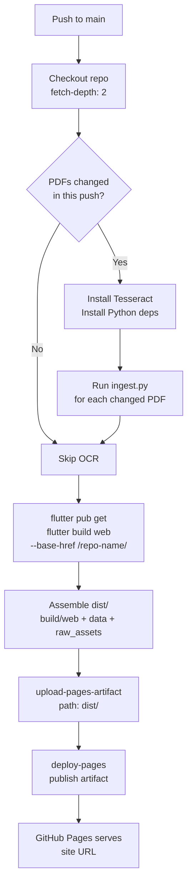

# Deployment

This document explains how the app is built and deployed to GitHub Pages using GitHub Actions, and what needs to be configured before the first deployment.

---

## How it works

Every push to `main` triggers the `build-index.yml` workflow. The pipeline has six steps:



### Change detection

The workflow uses `git diff --name-only HEAD~1 HEAD -- 'raw_assets/*.pdf'` to detect which PDFs changed in the push. OCR only runs for changed books. A push that modifies only Dart code or JSON metadata skips OCR entirely and takes ~5 minutes (Flutter build + deploy). A push with a new 425-page PDF takes ~35–40 minutes.

### The `dist/` assembly

Flutter Web builds to `build/web/`. The deployment artefact (`dist/`) includes three directories combined:

```
dist/
  ├── (Flutter web output from build/web/)
  ├── data/
  │   ├── catalog.json
  │   └── indices/
  └── raw_assets/
      └── *.pdf
```

The Flutter web output includes all static web assets. `data/` and `raw_assets/` are copied into `dist/` so they are served on the same origin as the app.

### GitHub Pages publish mode

The workflow uses official Pages deployment actions and uploads `dist/` as a Pages artifact. GitHub then publishes that artifact. No direct branch-push deploy step is required.

---

## Before the first deployment — checklist

### 1. Update `lib/config.dart`

Replace the placeholder with your actual GitHub Pages URL:

```dart
static const String githubPagesUrl =
    'https://your-github-username.github.io/your-repo-name';
```

This value is used by iOS and Android builds to know where to fetch `catalog.json` and PDFs from. On web, `Uri.base` is used instead, so this field only matters for mobile.

### 2. Update the workflow `--base-href`

In `.github/workflows/build-index.yml`, find:

```yaml
flutter build web --base-href /library-manager/ --release
```

Replace `library-manager` with your actual repository name:

```yaml
flutter build web --base-href /your-repo-name/ --release
```

This injects the correct path prefix into `web/index.html`. Without this, all asset references in the deployed app resolve against `https://username.github.io/` (the root) instead of `https://username.github.io/your-repo-name/`, causing 404 errors for every resource.

### 3. Content operations mode

Content publishing is developer-managed via git.

### 4. Enable GitHub Pages in repo settings

1. Go to your repo on GitHub → **Settings** → **Pages**.
2. Under **Source**, select **GitHub Actions**.
3. Save.
4. Click **Save**.

The `gh-pages` branch does not exist yet — it will be created automatically on the first workflow run.

### 5. Grant Actions permissions

The workflow deploys through Pages actions and needs workflow-level permissions:

1. Go to **Settings** → **Actions** → **General**.
2. Under **Workflow permissions**, select **Read and write permissions**.
3. Click **Save**.

### 6. Push to trigger the first deployment

```bash
git add .
git commit -m "Initial deployment configuration"
git push origin main
```

Watch the Actions tab. The first run takes longer because it installs all system dependencies and Flutter. Subsequent runs use caching.

---

## Accessing the deployed app

After a successful workflow run:

| URL | What's served |
|---|---|
| `https://username.github.io/repo-name/` | Flutter Web app (library catalog) |
| `https://username.github.io/repo-name/data/catalog.json` | Book catalog JSON |
| `https://username.github.io/repo-name/data/indices/<id>.json` | Book index JSON |
| `https://username.github.io/repo-name/raw_assets/<file>.pdf` | PDF (publicly accessible) |


---

## GitHub Pages limits

| Limit | Value | Notes |
|---|---|---|
| File size | 100 MB hard | PDFs must be under 100 MB. Recommended max: 50 MB. |
| Repo size | 1 GB soft | GitHub sends a warning email at 1 GB. No hard cutoff. |
| Bandwidth | 100 GB/month soft | ~2,000 full 50 MB PDF downloads. Hard to hit with a small audience. |
| Build time | 10 min (Pages build) | The Flutter build runs in GitHub Actions, not the Pages build system — no time limit applies from Pages. Actions free tier: 2,000 min/month. |

---

## iOS and Android builds

The Flutter codebase supports iOS and Android from the same source. Deployment for mobile platforms is separate from the GitHub Pages web deployment.

### iOS (requires macOS + Apple Developer account for distribution)

```bash
# Development build (no account needed, runs on simulator or dev-registered device)
flutter build ios

# Production archive (requires Apple Developer account, $99/year)
flutter build ios --release
```

For TestFlight distribution, open `ios/Runner.xcworkspace` in Xcode and follow the Archive → Distribute workflow.

### Android

```bash
# APK for direct distribution (sideloading)
flutter build apk --release

# App bundle for Google Play ($25 one-time account fee)
flutter build appbundle --release
```

Direct APK sharing (via Google Drive link, QR code, etc.) requires no account. Google Play distribution requires a Google Play Developer account.

Before building for mobile, update `lib/config.dart` with the GitHub Pages URL so the mobile app knows where to fetch data from:

```dart
static const String githubPagesUrl =
    'https://your-github-username.github.io/your-repo-name';
```

---

## Updating the deployment

Any push to `main` triggers a full redeploy. There is no separate "deploy" step — the pipeline handles everything. To update:

- **App code change**: push the Dart change → Actions rebuilds Flutter Web and deploys.
- **New book**: follow the [Admin Guide](admin-guide.md#admin-workflow--adding-a-new-book-current) — push PDF + reviewed index + updated catalog → Actions deploys.
- **Metadata correction**: edit `catalog.json` or a book index, commit, push → Actions deploys (no OCR re-run since no PDF changed).
