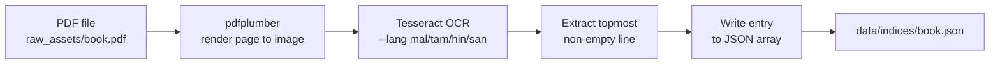

# OCR Pipeline

`scripts/ingest.py` processes a PDF page by page using Tesseract OCR and produces a JSON song index that the Flutter app uses for search. This document explains installation, usage, expected output, and the mandatory human review step.

---

## How it works



For every page in the PDF, the script:
1. Renders the page to a PIL image at the configured DPI.
2. Runs Tesseract with the book's language pack.
3. Takes the **topmost non-empty text line** as the song title — this assumes each page starts with a song title header.
4. Writes a JSON entry with `song_id`, `title_native`, `page_number`, and empty fields for `title_en`, `category`, and `tags` that you fill in manually.

---

## Installation

### Tesseract and language packs (Ubuntu / GitHub Actions)

```bash
sudo apt update
sudo apt install \
  tesseract-ocr \
  tesseract-ocr-mal \
  tesseract-ocr-tam \
  tesseract-ocr-hin \
  tesseract-ocr-san \
  libtesseract-dev
```

| Package | Language |
|---|---|
| `tesseract-ocr-mal` | Malayalam |
| `tesseract-ocr-tam` | Tamil |
| `tesseract-ocr-hin` | Hindi (Devanagari) |
| `tesseract-ocr-san` | Sanskrit (Devanagari) |

Verify installation:
```bash
tesseract --list-langs
# should include: mal, tam, hin, san
```

### Python environment

```bash
python3 -m venv library_env
source library_env/bin/activate
pip install -r scripts/requirements.txt
```

---

## Usage

```
python scripts/ingest.py \
  --book-id   <book_id> \
  --pdf       <path/to/file.pdf> \
  --lang      <mal|tam|hin|san> \
  --output    <path/to/output.json> \
  [--dpi      <200>]
```

### Arguments

| Argument | Required | Description |
|---|---|---|
| `--book-id` | Yes | Must match `book_id` in `catalog.json`. Used as prefix for all `song_id` values in the output. |
| `--pdf` | Yes | Path to the source PDF, e.g. `raw_assets/bhajanamritam_01.pdf`. |
| `--lang` | Yes | Tesseract language pack. Must be one of: `mal`, `tam`, `hin`, `san`. |
| `--output` | Yes | Output path for the JSON index. Must match `index_file` in `catalog.json`. |
| `--dpi` | No | Page render resolution. Default `200`. Higher DPI improves accuracy but increases runtime. Use `300` for better results on complex typography. |

### Examples

**Malayalam book:**
```bash
python scripts/ingest.py \
  --book-id   bhajanamritam_01 \
  --pdf       raw_assets/bhajanamritam_01.pdf \
  --lang      mal \
  --output    data/indices/bhajanamritam_01.json
```

**Tamil book:**
```bash
python scripts/ingest.py \
  --book-id   thiruppugazh_01 \
  --pdf       raw_assets/thiruppugazh_01.pdf \
  --lang      tam \
  --output    data/indices/thiruppugazh_01.json
```

**Hindi book:**
```bash
python scripts/ingest.py \
  --book-id   bhajan_sangrah_01 \
  --pdf       raw_assets/bhajan_sangrah_01.pdf \
  --lang      hin \
  --output    data/indices/bhajan_sangrah_01.json
```

---

## Understanding the output

The script writes a JSON array. Each entry looks like this:

```json
{
  "song_id": "bhajanamritam_01_0188_anchel",
  "title_native": "അഞ്ചേൽ",
  "title_en": "",
  "language": "ml",
  "category": "",
  "page_number": 188,
  "tags": []
}
```

Fields left empty by the script (`title_en`, `category`, `tags`) must be filled in manually during review.

---

## The human review step — mandatory before committing

**Never commit the raw OCR output without reviewing it.** The script will have errors. Here is what to look for:

### 1. Overflow pages
A song that starts on page N and continues on page N+1 has **no title on page N+1** — just song text. The OCR will pick up the first line of lyrics as the "title". These entries must be deleted from the JSON (the page is already reachable via the previous song's entry).

Signs of an overflow page entry:
- `title_native` starts mid-sentence or with a word that is clearly not a title
- Two entries in a row where the second title looks like a lyric fragment

### 2. OCR misreads on complex typography
Traditional Malayalam, Tamil, and Sanskrit fonts contain ligatures that Tesseract misreads. Common patterns:
- Characters merged or split incorrectly
- Vowel marks dropped or swapped
- Numbers misread as characters (or vice versa)

Fix by reading the PDF and correcting `title_native` in the JSON.

### 3. Running headers
Some books have a chapter or raga name printed at the top of every page (a "running header"). If the header appears above the song title, it will be captured instead of the title. Delete these entries or correct the title.

### 4. Empty entries (skipped pages)
Pages with completely unreadable text are skipped automatically. The script prints a count of skipped pages. If the count is higher than expected, check those pages in the PDF and add entries manually if needed.

---

## Filling in the manual fields

After cleaning up OCR errors, fill in the empty fields:

| Field | What to put |
|---|---|
| `title_en` | English phonetic transliteration. E.g. `"Anchel"` for `"അഞ്ചേൽ"`. This enables English-phonetic search in the app. |
| `category` | Deity or subject. E.g. `"Ganapati"`, `"Murugan"`, `"Shiva"`. Used for search and displayed as a chip in the song list. |
| `tags` | Lowercase keywords: raga name, tala, occasion, etc. E.g. `["kuntalavarali", "adi", "murugan"]`. |

---

## Mixed-language books

If a book contains songs in more than one language (e.g. Tamil songs with Sanskrit shlokas), the `primary_language` of the book sets the default Tesseract pack. Pages in the minority language will have lower OCR accuracy.

Workarounds:
- Run ingest.py twice with different `--lang` flags and merge the outputs manually, assigning the correct `language` code per entry.
- Accept lower accuracy for minority-language pages and correct manually during review.

---

## Runtime estimates

| Pages | DPI | Approx. time |
|---|---|---|
| 100 | 200 | ~8 min |
| 425 | 200 | ~35 min |
| 425 | 300 | ~60 min |

Tesseract processes one page at a time. Larger DPI increases both accuracy and runtime. DPI 200 is a good default; use 300 if titles are consistently misread.

GitHub Actions free tier provides 2,000 minutes/month for public repos. Since OCR only runs on **changed PDFs** (detected by `git diff` in the workflow), a typical push that adds one book uses ~35 minutes of quota. Unrelated code pushes use ~5 minutes (Flutter build only).

---

## OCR automation now: what is realistic

Yes, OCR can be automated further now, but full zero-touch accuracy is not realistic for this dataset. A practical approach is staged automation.

### Level 0 (current)

- Trigger OCR automatically on changed PDFs in CI.
- Require manual review before accepting index quality.

This is the safest baseline and is already implemented.

### Level 1 (recommended now)

Automate quality gates in CI so bad OCR output fails fast:

1. **Missing-asset guard**: fail if any `asset_url` in `data/catalog.json` does not exist.
2. **Index existence guard**: fail if a catalog entry references a missing `index_file`.
3. **Basic OCR quality checks** on generated index:
  - empty `title_native` count threshold
  - duplicate `page_number` detection
  - suspicious title patterns (very short titles, numeric-only titles)
4. **Diff summary artifact**: upload a report (`ocr_report.json`) with counts and flagged entries.

This keeps humans in control while eliminating obvious errors early.

### Level 2 (semi-automated review)

Add post-processing to reduce manual edits:

1. Header/footer suppression using page region cropping before OCR.
2. Language fallback pass for mixed-language books (e.g. run `tam` then retry failed pages with `san`).
3. Transliteration helper script to prefill `title_en` suggestions (human-verified before commit).

This can cut manual review time significantly, but still requires approval.

### Level 3 (full automation, not recommended yet)

Fully automatic commit of OCR output with no review is risky for your books due to typography and overflow-page edge cases. Expect noisy search data and production corrections.

For this project, Level 1 + partial Level 2 is the best reliability/cost tradeoff.

---

## Next actions for automation

1. Add CI guards for missing `asset_url` and `index_file` references.
2. Add OCR quality thresholds and fail the workflow on severe anomalies.
3. Upload an OCR quality report as a build artifact for quick review.
4. Add optional second-pass language fallback for mixed-language books.
